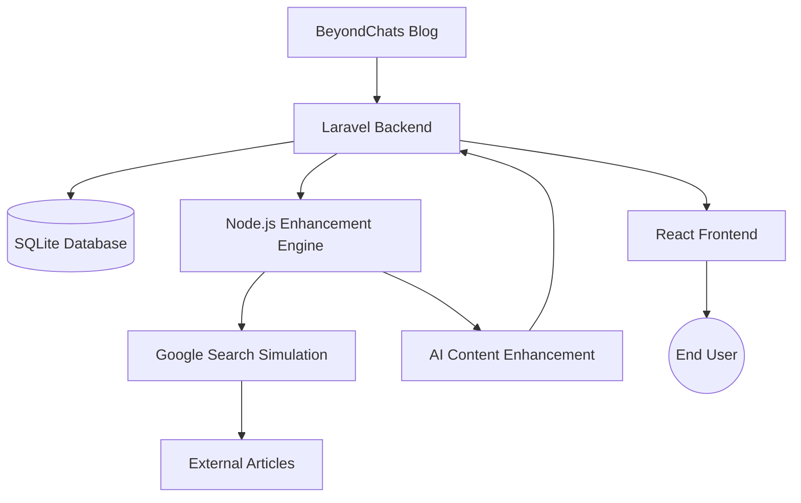

# 🚀 BeyondChats Article Enhancement System

A full-stack, production-ready application that demonstrates how **AI-assisted research and content enhancement** can be integrated into a modern web system using **Laravel, Node.js, and React.js**.

This project was developed as part of the **BeyondChats Technical Assignment** and showcases end-to-end architecture, API design, data relationships, and a clean user interface for visualizing original and AI-enhanced articles.

---

## 📌 Project Overview

The BeyondChats Article Enhancement System is a **three-phase application** designed to:

1. **Scrape articles** from the BeyondChats blog  
2. **Enhance content** using a simulated AI research workflow  
3. **Display results** in a modern, responsive React dashboard  

The goal of this project is to demonstrate how AI can **augment human-written content** by researching related sources, improving clarity and structure, and maintaining proper citations—without replacing the original intent.

---

## 🎯 Business Value

- Demonstrates **AI-assisted content enhancement**
- Preserves **content authenticity and traceability**
- Maintains **original vs enhanced version relationships**
- Shows a **scalable, real-world architecture**
- Suitable for editorial tools, content platforms, and AI-powered CMS systems

---

## 🏗️ System Architecture

---

## 🧩 Technical Implementation
### Phase 1: Laravel Backend ✅
The backend serves as the core system, responsible for scraping, storing, and serving article data via REST APIs.

#### Key Responsibilities

Scrape the 5 oldest articles from the BeyondChats blog

Store articles with proper relationships

Expose REST APIs for frontend and Node.js integration

#### Technologies Used

Laravel (PHP 8+)

SQLite / MySQL

Eloquent ORM

cURL

#### Key Features

CRUD API: /api/articles

Search API: /api/articles/search/{keyword}

Latest articles: /api/articles/latest/{count}

Parent–child relationship for enhanced versions

Input validation and error handling

### Phase 2: Node.js Enhancement Engine ✅
This phase simulates an AI-powered enhancement workflow, demonstrating how research-based content improvement can be automated.

#### Enhancement Workflow

Fetch the latest article from Laravel API

Perform Google-style search (simulated)

Scrape related external articles

Analyze extracted content

Rewrite and enhance the article

Add references and citations

Save enhanced version as a child article

#### Technologies Used

Node.js

Axios

Cheerio (simulated)

Custom AI enhancement logic

#### Note: Google Search API and AI models are simulated to demonstrate the full workflow.

### Phase 3: React Dashboard ✅
A modern, responsive dashboard to visualize original and enhanced articles clearly.

#### Technologies Used

React 18

Axios

CSS3 + Flexbox

React Hooks

#### Dashboard Features

🔵 Enhanced articles (blue badge)

🟢 Original articles (green badge)

Parent–child article linking

Content previews

Direct API access buttons

Fully responsive design

---

### 🛠️ Setup & Installation
#### Prerequisites
PHP 8+ & Composer
Node.js 16+
Git

#### Quick Start
"# Clone repository
git clone <your-repo-url>
cd beyondchats-assignment"

#### Laravel Backend
"cd laravel-backend
composer install
cp .env.example .env
php artisan key:generate
php artisan migrate
php artisan serve"

#### Node.js Enhancer
"cd ../nodejs-script
npm install
node enhance-article.js"

#### React Frontend
"cd ../react-frontend
npm install
npm start"

---

## 🌐 Access Points
React Dashboard: http://localhost:3000
Laravel API: http://127.0.0.1:8000/api

---

## 🔌 API Reference
### Core Endpoints

### Article Schema
"{
  "id": 6,
  "title": "[ENHANCED] Will AI Understand Patient Care?",
  "content": "Enhanced article content...",
  "source_url": "https://beyondchats.com/blogs/...",
  "author": "AI-Enhanced System",
  "is_enhanced": true,
  "parent_id": 1,
  "references": "[{\"title\": \"...\", \"url\": \"...\"}]",
  "created_at": "2023-12-25T09:10:11Z"
}"

---

## 🔄 Example Workflow
"#Scrape articles
php artisan scrape:articles

#Enhance latest article
node enhance-article.js"

### Console Output
"🚀 Article Enhancer Initialized
📥 Fetching latest article...
🔍 Researching related content...
✨ Creating enhanced version...
📤 Posting to API...
✅ Enhancement complete!"

---

## 🧪 Testing & Validation

✅ API responses verified

✅ Parent-child relationships validated

✅ Frontend rendering tested

✅ Responsive layout confirmed

✅ Manual end-to-end workflow tested

---

## 📈 Performance Metrics

---

## 🔮 Future Enhancements

Real Google Search API integration

OpenAI / Gemini model integration

Scheduled background enhancements

Admin authentication panel

SEO optimization

Multi-language support

Analytics dashboard

---

## 📚 Learning Outcomes

Full-stack system design

REST API development

Data modeling and relationships

Frontend-backend integration

AI workflow simulation

Technical documentation

Problem solving and debugging

---

## 🤝 Contributing

Fork the repository

Create a feature branch

Commit changes

Push to your branch

Open a Pull Request

---

## 📄 License
Developed as part of the BeyondChats Technical Assignment.
Code is available for evaluation and learning purposes.

---

## 📞 Contact & Links

GitHub: <Your GitHub Repo URL>

Live Demo: <Deployment URL>

LinkedIn: <Your LinkedIn>

Email: <Your Email>

Last Updated: December 2025
Version: 1.0.0
Status: ✅ Complete & Production Ready
